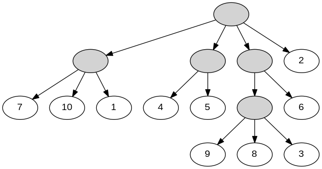
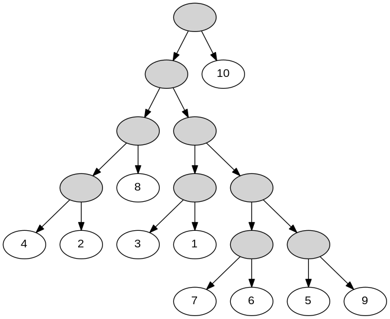

# Computing the Rooted Triplet Distance between Two Trees

Problem: given two rooted trees T1 and T2 built on the same leaf label set of size n, compute the rooted triplet distance between T1 and T2.

A sample generator for creating input trees is provided, as well as implementations of an O(qn) algorithm, where q is the total number of internal nodes in the smaller tree.

# Compilation

generator: g++ -O3 -std=c++11 -o generator generator.cpp

triplet distance algorithm: g++ -O3 -std=c++11 -o qtd main.cpp

# Creating Sample Inputs

type ./generator q n outputFile

It creates a tree T as follows:

1. If q = -1, build a binary tree with n leaves following the uniform model. Let A be an array of size n such that A[i] = i for i = 1 to n. Shuffle this array uniformly at random and in the end let every leaf that is the j-th in depth first order have the label A[j].
2. Otherwise, build a tree with q internal nodes as follows: start with one node, and while the total number of nodes is less than q, pick a node uniformly at random and add a child to that node. For every leaf x, pick an internal node uniformly at random and make x a child of that node. Finally, assign the leaf labels as in 1.

# Running the triplet distance algorithm

type ./qtd tree1.txt tree2.txt

Input format: The two trees should be stored in Newick format.

Output format: The output is the triplet distance between T1 and T2.

# Examples

./generator 5 10 1.txt

Newick format: ((7,10,1),(4,5),((9,8,3),6),2);

./generator -1 10 1.txt

Newick format: ((((4,2),8),((3,1),((7,6),(5,9)))),10);

./qtd 1.txt 2.txt

Triplet distance: 103
